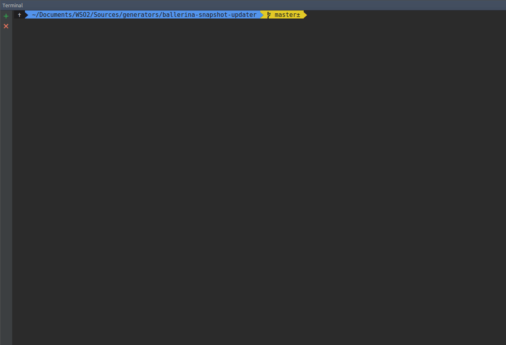

# Ballerina Snapshot Updater

Makes snapshot version updating in Ballerina repos easier by updating release branches and sending pull requests.



## Prerequisites

You need following applications to run the BSU.

1. [git](https://git-scm.com/downloads)
2. [hub](https://hub.github.com)
3. [node + npm](https://nodejs.org/en/download/)
4. Other tools which needs to build repos mentioned below.
5. Clone required repos (mentioned below) to `sources/` directory in this repo. Make sure to add `origin` and `upstream` correctly. Recommended way is to add a symlink named `sources` to the directory containing already cloned repos using following command.

       ln -s PATH_TO_GIT_SOURCES_ROOT_DIR sources
       
   Eg: 
       
   If you have repos mentioned below including this repo in the same directory -
       
       ln -s ../ sources
        
6. Update Ballerina versions in patches using find and replace tool (this needs to be automated as well in the future).

   Eg: 0.95.9 -> 0.95.10

#### Required Repos
1. [ballerina-parent](https://github.com/ballerinalang/ballerina-parent)
2. [ballerina](https://github.com/ballerinalang/ballerina)
3. [language-server](https://github.com/ballerinalang/language-server)
4. [docerina](https://github.com/ballerinalang/docerina)
5. [plugin-maven](https://github.com/ballerinalang/plugin-maven)
6. [composer](https://github.com/ballerinalang/composer)
7. [testerina](https://github.com/ballerinalang/testerina)
8. [container-support](https://github.com/ballerinalang/container-support)
9. [tools-swagger-ballerina](https://github.com/ballerinalang/tool-swagger-ballerina)
10. [tools-distribution](https://github.com/ballerinalang/tools-distribution)

## How To Use

Run the following command. 

```bash
npm run updater
```
